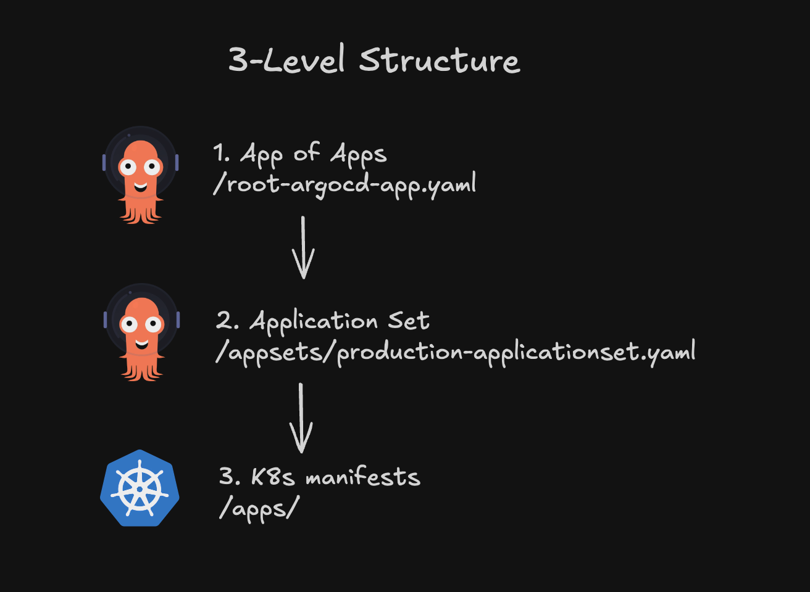

<div align="center">


<!-- markdownlint-disable no-trailing-punctuation -->

### A Kubernetes Homelab Repository

_... managed with ArgoCD_ 

</div>

<div align="center">
    <a href="https://argo-cd.readthedocs.io/en/stable/" target="_blank">
        
    </a>
    <a href="https://k3s.io/" target="_blank">
        
    </a>
    <a href="https://longhorn.io/" target="_blank">
        
    </a>
    <a href="https://1password.com/developer" target="_blank">
        
    </a>
</div>

---

# k3s-homelab

A fully declarative, GitOps-driven homelab platform designed to emulate real-world production environments with modern DevOps and Platform Engineering best practices.

This project uses an [App of Apps](https://medium.com/containers-101/how-to-structure-your-argo-cd-repositories-using-application-sets-1150e75d05b3) pattern to bootstrap an empty cluster into a fully functional, observable, and self-healing Kubernetes environment.

---

## Overview

This homelab serves as both a learning platform and a production environment for my personal use, demonstrating the management of Kubernetes clusters through GitOps workflows.

Goals:

- Reproducible and declarative cluster management
- Modular architecture mirroring cloud-native infrastructure

---

## Platform Capabilities

- Declarative Infrastructure - Everything is Git-versioned and reproducible.
- GitOps Automation - ArgoCD continously reconciles desired vs live state.
- Zero-Trust Networking - Cloudflare Tunnels to expose services without port forwarding.
- Resilient Storage - Longhorn provides replication and snapshot recovery.
- External Secrets - 1Password Operator manages Kubernetes secrets securely.
- Observability - Prometheus and Grafana provide system-level insights.

---

## Hardware

The k3s cluster is comprised of 3 cost-effective and energy-efficient MiniPCs. The home network is managed by a Ubiquiti Cloud Gateway Ultra. Off-cluster storage for media is provided by a Synology NAS.

| Device                       | Count | Disk Size | RAM  | Operating System   | Notes                          |
| ---------------------------- | ----- | --------- | ---- | ------------------ | ------------------------------ |
| GMKtec Mini PC NucBox G5 N97 | 3     | 256GB     | 12GB | Fedora Server 42   | k3s master + worker nodes      |
| Synology NAS - DS923+        | 1     | 24TB      | 4GB  |                    | NFS volumes for existing media |
| Ubiquiti Cloud Gateway Ultra | 1     |           |      |                    | Network management             |

---

## Repository Structure



```
.
├── apps/
│   ├── cloudflared/
│   ├── homepage/
│   ├── linkding/
│   ├── plex/
│   └── transmission/
├── apps-helm/
│   └── redis/
├── appsets/
├── docs/
├── infrastructure/
├── infrastructure-helm/
│   ├── cert-manager/
│   ├── longhorn-system/
│   └── monitoring/
└── root-argocd-app.yaml
```

- **apps/**: Contains Kubernetes manifests for applications deployed using Kustomize.
- **apps-helm/**: Contains Helm charts for applications.
- **appsets/**: Contains ArgoCD ApplicationSets for managing applications across different environments.
- **docs/**: Contains documentation for the project.
- **infrastructure/**: Contains Kubernetes manifests for infrastructure components.
- **infrastructure-helm/**: Contains Helm charts for infrastructure components.
- **root-argocd-app.yaml**: The root ArgoCD application that bootstraps the entire cluster.