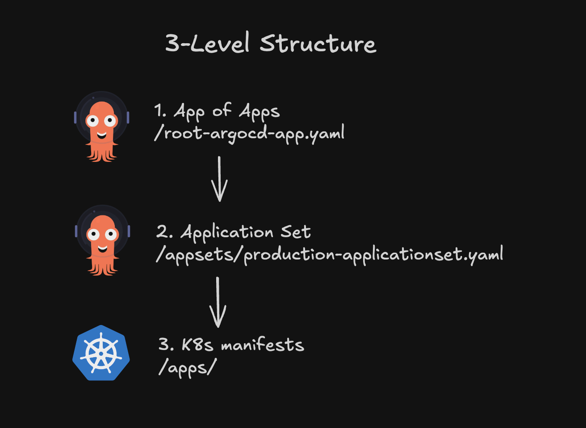

<div align="center">


<!-- markdownlint-disable no-trailing-punctuation -->

### A Kubernetes Homelab Repository

_... powered by K3s and ArgoCD_ 

</div>

<div align="center">
    <a href="https://argo-cd.readthedocs.io/en/stable/" target="_blank">
        
    </a>
    <a href="https://k3s.io/" target="_blank">
        
    </a>
    <a href="https://longhorn.io/" target="_blank">
        
    </a>
    <a href="https://developer.1password.com/docs/k8s/operator/">
        
    </a>
</div>

<div align="center">

[&replace=%241&label=k3s&logo=k3s&logoColor=white&color=FFC61C)](https://github.com/simonyjung/k3s-homelab/blob/main/infrastructure/system-upgrade/plans.yaml)
[](https://github.com/simonyjung/k3s-homelab/commits/main)

[](https://home.simonjung.io)
[](https://home.simonjung.io)
[](https://home.simonjung.io)
[](https://home.simonjung.io)
[](https://home.simonjung.io)

</div>

---

# k3s-homelab

A fully declarative, GitOps-driven homelab platform designed to emulate real-world production environments with modern DevOps and Platform Engineering best practices.

This project uses an [App of Apps](https://medium.com/containers-101/how-to-structure-your-argo-cd-repositories-using-application-sets-1150e75d05b3) pattern to bootstrap an empty cluster into a fully functional, observable, and self-healing Kubernetes environment.

Check out the publically available [service catalog/homepage](https://home.simonjung.io).

---

## Overview

This homelab serves as both a learning platform and a production environment for my personal use.

Goals:

- Reproducible and declarative cluster management
- Modular architecture mirroring cloud-native infrastructure

---

## Platform Capabilities

- Declarative Infrastructure - Everything is Git-versioned and reproducible.
- GitOps Automation - ArgoCD continously reconciles desired vs live state.
- Zero-Trust Networking - Cloudflare Tunnels to expose services without port forwarding.
- Highly Available Control Plane - three K3s servers on embedded etcd, so the API survives any single node failure or reboot; etcd snapshots twice daily.
- Highly Available Ingress - MetalLB provides a floating VIP for LAN traffic, so no single node is a bottleneck; design in [docs/load-balancing.md](./docs/load-balancing.md).
- Resilient Storage - Longhorn provides replication and snapshot recovery.
- Off-cluster Backups - nightly incremental Longhorn backups to the NAS with bounded retention; restore procedures in [docs/restore.md](./docs/restore.md).
- External Secrets - 1Password Operator manages Kubernetes secrets securely.
- Observability - Prometheus and Grafana provide system-level insights.
- Centralized Logging - OpenObserve stores 15 days of every pod's logs plus the k3s journal (including etcd), shipped from all nodes by a Fluent Bit DaemonSet and searchable with full-text queries and dashboards.
- Error Tracking - GlitchTip captures application exceptions with stack traces and request context; apps report with the stock Sentry SDK against in-cluster DSNs, backed by a replicated CloudNativePG database.
- CI Validation Gates - every PR renders all manifests, schema-checks them with kubeconform against the exact cluster version, and gets a bot comment with the full rendered diff of what the cluster will see on merge; see [docs/ci.md](./docs/ci.md).
- Policy-as-Code Auditing - Kyverno evaluates Pod Security Standards plus best-practice policies in audit mode, maintaining a live compliance inventory without ever blocking admission; see [docs/policy.md](./docs/policy.md).
- Benchmarking - version-controlled k6 load tests ([benchmarks/](./benchmarks/)) ramp requests-per-second against deployed apps, stream results to Prometheus for Grafana dashboards, and log findings to a durable run record.
- Patched Nodes - unattended security updates with staggered one-node-per-night reboot windows; see [docs/node-updates.md](./docs/node-updates.md).

---

## Dependency Management

This repository uses [Renovate](https://github.com/renovatebot/renovate) to automatically update dependencies of Docker images, and Helm charts. The configuration is managed in the [`.github/renovate.json`](./.github/renovate.json) file.

### Kubernetes updates

Renovate also tracks [K3s releases](https://github.com/k3s-io/k3s/releases) and raises a PR when a new version is available, by watching the `version:` fields in [`infrastructure/system-upgrade/plans.yaml`](./infrastructure/system-upgrade/plans.yaml). Merging the PR **is** the cluster upgrade: Argo CD syncs the updated upgrade plans and the [system-upgrade-controller](https://github.com/rancher/system-upgrade-controller) rolls the new K3s version across the nodes (control plane first, then agents one at a time). Because Kubernetes control planes cannot skip minor versions, Renovate opens one PR per minor — merge them in order, letting the cluster settle between hops. See [docs/upgrades.md](./docs/upgrades.md) for the full procedure.

---

## Hardware

The k3s cluster is comprised of 3 cost-effective and energy-efficient MiniPCs. The home network is managed by a Ubiquiti Cloud Gateway Ultra. Off-cluster storage for media is provided by a Synology NAS.

| Device                       | Count | Disk Size | RAM  | Operating System   | Notes                          |
| ---------------------------- | ----- | --------- | ---- | ------------------ | ------------------------------ |
| GMKtec Mini PC NucBox G5 N97 | 3     | 256GB     | 12GB | Fedora Server 44   | k3s servers (HA control plane + etcd) + workers |
| Framework Desktop            | 1     | 1TB       | 32GB | Fedora Server 44   | GPU worker node                |
| Synology NAS - DS923+        | 1     | 24TB      | 4GB  |                    | NFS volumes for existing media |
| Ubiquiti Cloud Gateway Ultra | 1     |           |      |                    | Network management             |

---

## Repository Structure

<div align="center">
    
</div>


The repository follows a 3-level structure:

Level 1 – Root Application (App-of-Apps):
A single root YAML manifest references all ApplicationSets. Deploying this file bootstraps an empty cluster with every required application in a single step.

Level 2 – ApplicationSets:
ApplicationSets define groups of related applications for a specific environment. They let Argo CD manage multiple apps declaratively without manually creating individual Application resources.

Level 3 – Base Applications:
These are fully self-contained Kustomize or Helm templates. Each can be deployed independently to any cluster without relying on Argo CD.

```
.
├── apps/                  # Level 3 (Kustomize apps)
│   ├── cloudbeaver/
│   ├── django-starter/
│   ├── homepage/
│   ├── kromgo/
│   ├── linkding/
│   ├── plex/
│   ├── shaadimubarak/
│   └── transmission/
├── apps-helm/             # Level 3 (Helm umbrella charts for apps)
│   └── glitchtip/
├── appsets/               # Level 2
├── benchmarks/            # k6 load-test scenarios + run log (applied manually, never ArgoCD-synced)
├── docs/
├── infrastructure/        # Kustomize infrastructure (plain manifests)
│   ├── kube-vip/
│   └── system-upgrade/
├── infrastructure-helm/   # Helm umbrella charts for infrastructure
│   ├── 1password/
│   ├── argocd/
│   ├── cert-manager/
│   ├── cloudnative-pg/
│   ├── k6-operator/
│   ├── kyverno/
│   ├── longhorn-system/
│   ├── metallb/
│   ├── monitoring/
│   ├── openobserve/
│   ├── tailscale/
│   └── traefik/
├── notes/                 # Operations journal (plan + history)
├── scripts/               # Shared CI/local tooling (render-all.sh)
└── root-argocd-app.yaml   # Level 1
```

- **apps/**: Kubernetes manifests for applications deployed using Kustomize (`base/` + `envs/<env>/` overlays).
- **apps-helm/**: Helm umbrella charts for applications, split per environment under `envs/<env>/values.yaml` (currently GlitchTip error tracking).
- **appsets/**: ArgoCD ApplicationSets that auto-discover the directories above.
- **benchmarks/**: k6 load-test scenarios and the [run log](./benchmarks/results.yaml) — deliberately outside the ApplicationSet globs; see [benchmarks/README.md](./benchmarks/README.md).
- **docs/**: Documentation, including [CI and PR validation](./docs/ci.md), [policy auditing](./docs/policy.md), [upgrades](./docs/upgrades.md), [node OS updates](./docs/node-updates.md), [backup/restore](./docs/restore.md), [load balancing](./docs/load-balancing.md), and [dashboard auth](./docs/dashboard-auth.md).
- **infrastructure/**: Plain-manifest (Kustomize) infrastructure components, e.g. the K3s system-upgrade-controller.
- **infrastructure-helm/**: Helm umbrella charts for infrastructure components, including self-managed Argo CD and the 1Password operator.
- **notes/**: Operations journal — the [active plan](./notes/plan.md) and per-quarter history of completed items, updated alongside the PRs that do the work.
- **root-argocd-app.yaml**: The root ArgoCD application that bootstraps the entire cluster.
